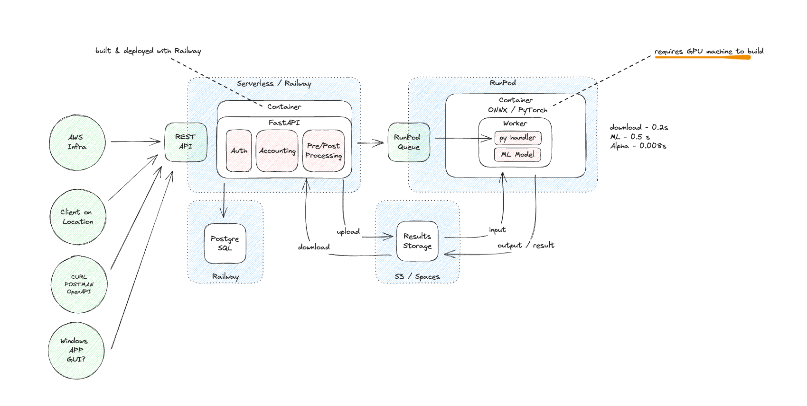

# Background Removal API

This is a central repository for background removal services (with ML) in the Cloud. It should be treated as a reference document and source of truth for all the components definitions and set up instructions. 

The main component at the heart of the system is a machine learning model for high resolution salient object detection based on [InSPyReNet](https://github.com/plemeri/InSPyReNet/) paper which is using Swin Transformer architecture. This model is considered to be achieving state of the art results in most of the rgb sailent object detections rgb benchmarks.

Besides the model component, the system consists of API component which is responsible for user auth, managing input & output and gathering accounting information.

## Using the API

You can find the OpenAPI documentation at railway deployment https://bkg-rm-api-production.up.railway.app/docs

In case you want to experiment with the API from the admin perspective you can use the following key. The Admin APIs are prefixed with `/admin/` path. 

ADMIN API KEY
```6221c617-1380-4912-88eb-ba737be2b8ce```

## Technology Stack

| Component         | Framework        | Provider     | Docs                                         |
|-------------------|------------------|--------------|----------------------------------------------|
| REST API          | FastAPI + Docker | Railway      | https://fastapi.tiangolo.com/                |
| ML Model          | InSPyReNet       | ONNX (+ PyTorch) | https://github.com/plemeri/InSPyReNet        |
| ML Implementation | Docker           | RunPod       | https://www.runpod.io/                       |
| Image Storage     | S3 Compatible    | DigitalOcean | https://www.digitalocean.com/products/spaces |
| Database          | PostgreSQL          | Railway.app   |                                              |


## Architecture

The system was designed to be modular where each piece can be easily scaled and deployed separately reducing vendor or infrastructure lock-in to the minimum. Each component consists of a separate container that can be deployed in any cloud provider.

The current setup has been optiomized for cost and development velocity, leveraging serverless providers. Once the setup is finalizaed it can be potentially moved to other cloud (or on prem) providers in order to streamline setup and optimize for operational use.  



## Potential Production Bottlenecks

Here is a list of potential challanges that should be discussed and adressed before releasing API for 24/7 production use

- automated monitoring and alerting (datadog/sentry + pagerduty)
- RunPod cold start - current deployment is set up to run 0 instances when not in use, for client testing it should be bumped to have at least 1 instance running at all times. This will introduce additional costs (~$20/day at the time of writing) but will eliminate cold start times almost entirely.
- dependency on small api provider (railway vs moving to GCP or AWS)
- multi-region deployment (both api and workers should be deployed to multiple locations for both relability and latency reasons)
- dependency on a single (and small) GPU provider. It's trivial to scale API but ML component needs proper hardware. A failover mechanism should be designed where different (probably more expensive) provider is used to handle ML workload (it would require creating external workload queueing/qos solution)
- remote debugging capabilties of the Windows GUI app. If it's supposed to be used in production we need an easy update and debugging process

## Pending Actions

The following items should be completed in order to get the setup stable and ready for production loads:
- [x] windows 10+ GUI app listetning for input images and generating results
- [ ] benchmark the current setup on a set of 100 images
    - average processing times: (matting, model, transfer, cold starts/queue)
    - average GPU usage during processing
    - look into processing time optimizations
- [ ] try to improve ML model execution to increase GPU usage 
