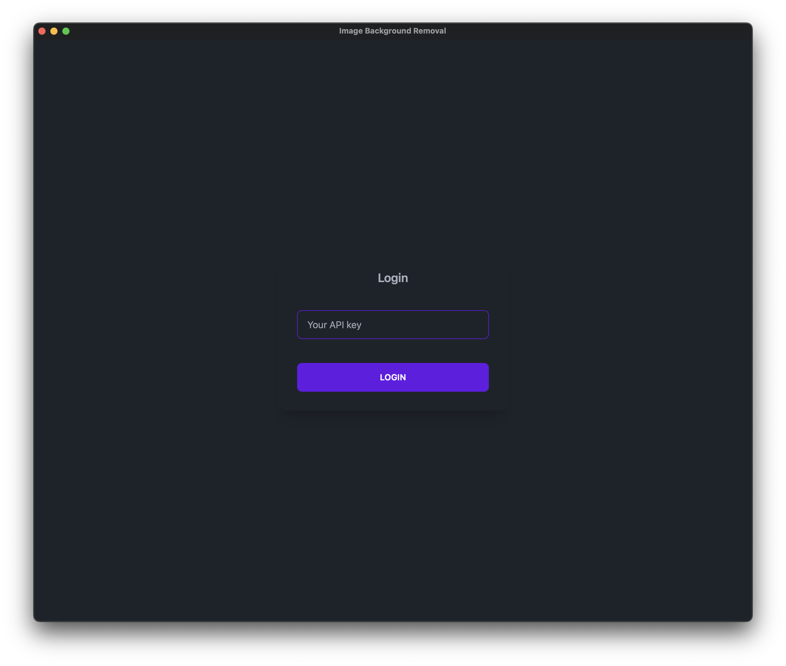
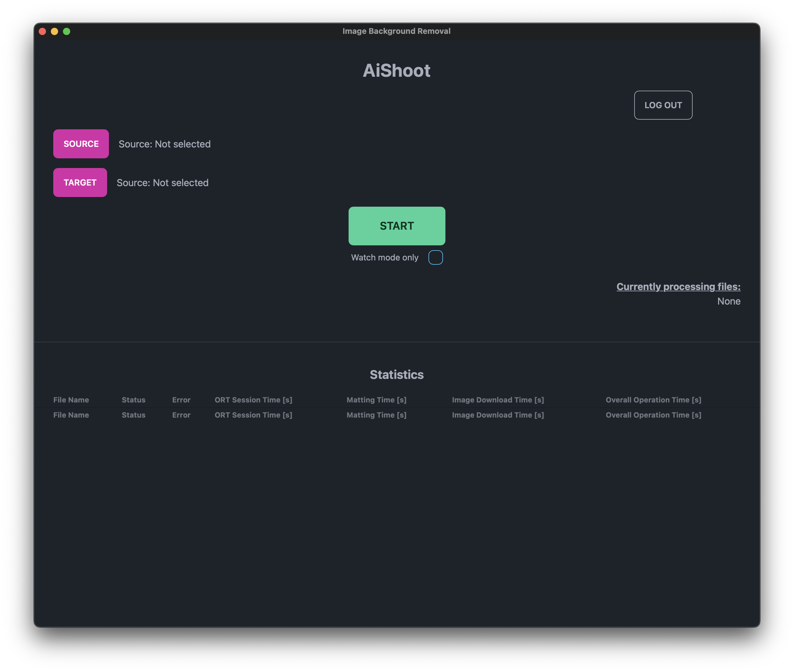
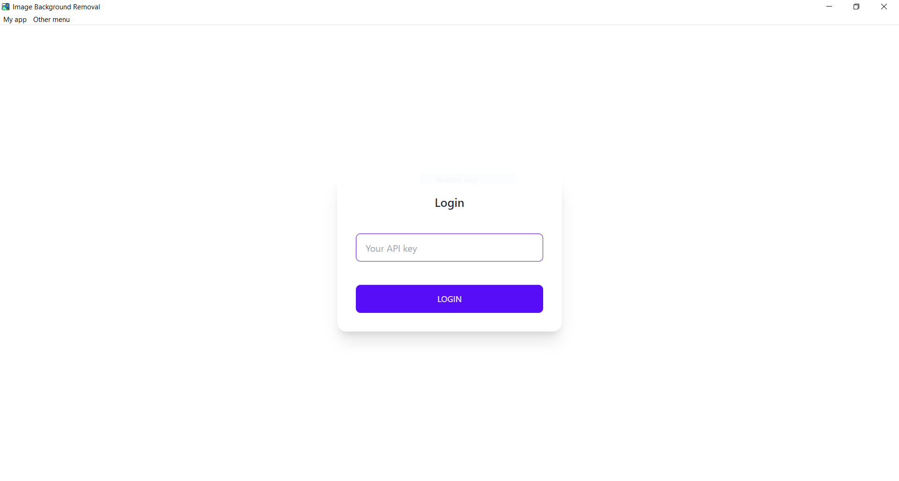
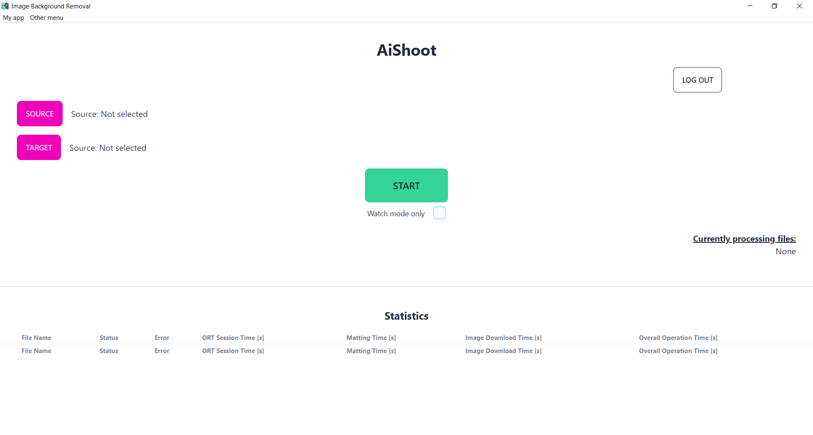

# Background Removal Desktop App

### Macos





### Windows





Desktop app created with [Tauri](https://tauri.app/). Application is build with use of [React](https://react.dev/) with [vite](https://vitejs.dev/) .

### Download

Pre-built desktop apps can be downloaded here:

- [Macos (arm)](https://aishoot.fra1.cdn.digitaloceanspaces.com/bkg-rm-desktop-app/bkg-rm_1.0.0_aarch64.dmg),
- [Windows](https://aishoot.fra1.cdn.digitaloceanspaces.com/bkg-rm-desktop-app/bkg-rm_1.0.0_x64-setup.exe)

(Mac) In case of the following message when starting the application: `"bkg-rm" is damaged and can't be opened...`, the following command should be run:

```
xattr -d com.apple.quarantine /Applications/bkg-rm.app
```

## Local environment setup

To setup local environment please follow [official Tauri documentation](https://tauri.app/v1/guides/getting-started/prerequisites).

### .env

Please see `.env.example` on how to setup env variables. These variables are reuqired for project set up.

### Development

```
yarn tauri:dev
```

### Production Build

```
yarn tauri:build
```

## Debugging on Windows

Install [Microsoft Edge Devtools](https://www.microsoft.com/en-au/p/microsoft-edge-devtools-preview/9mzbfrmz0mnj?rtc=1&activetab=pivot:overviewtab). Make sure you have Edge Legacy installed.

more info [here](https://github.com/tauri-apps/tauri/wiki/04.-MS-Windows-Setup#devtools)
